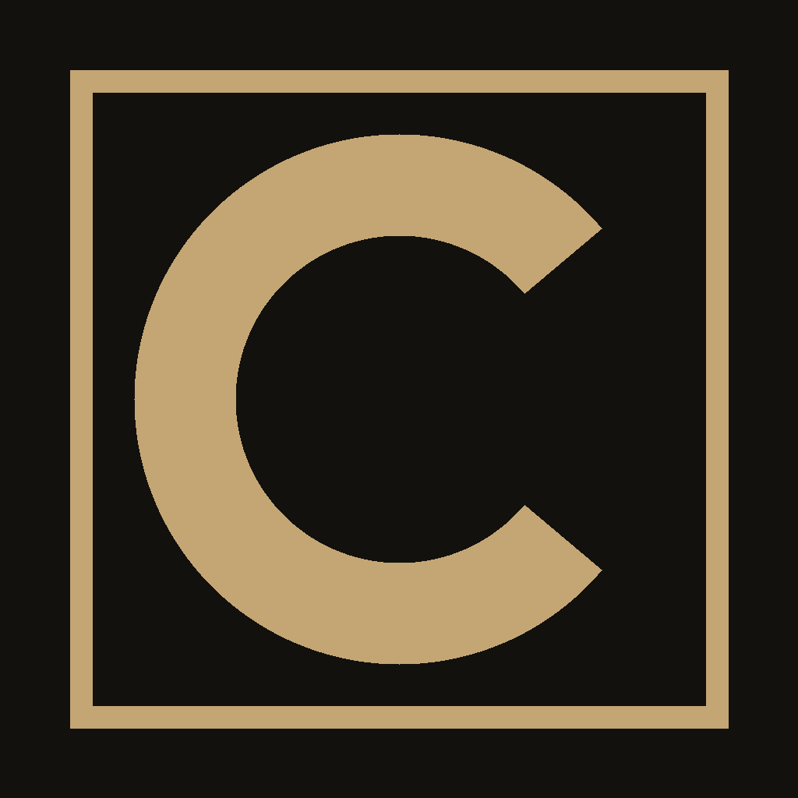

<p align="center">
  
</p>

<h1 align="center">CopyWritePrime</h1>

<p align="center">
  A desktop writing studio that stays in the sentence with you.
</p>

<p align="center">
  <a href="https://github.com/AaronGrace978/CopyWritePrime/releases/latest"></a>
  <a href="LICENSE"></a>
  
  
  
</p>

<p align="center">
  
  
  
  
  
  
  
</p>

You type messy. **Flow** waits for the pause, fixes the line, lifts it, then ghosts the next words. **Tab** keeps them. **⌘K** drops a prompt on the page. **Scan** a paper — PDF, Word, or paste — and **Complete** writes the submission onto the page. **Workshop** argues the line without moving the page. **Voice** scans a folder of past work and writes like that person. **Listen** reads the page with Kokoro. **Logs** exports or deletes chats. Gold on the page is AI. One click exports **Word**: Times New Roman 12, double-spaced, 1-inch margins. Em dashes are stripped on the way out.

Bring your own keys. OpenAI, Anthropic, Gemini, Groq, xAI, Mistral, DeepSeek, OpenRouter, Together, Fireworks, Perplexity, Cohere, **Ollama local**, **Ollama Cloud**, and any OpenAI-compatible endpoint. Keys live in the local Tauri store. Not our servers — there are no servers.

## Built with

| | |
| --- | --- |
| App shell | [Tauri 2](https://v2.tauri.app/) + [Rust](https://www.rust-lang.org/) |
| UI | [React 19](https://react.dev/) + [TypeScript](https://www.typescriptlang.org/) + [Vite 7](https://vite.dev/) |
| Editor | [TipTap](https://tiptap.dev/) / ProseMirror |
| Speech | [Kokoro](https://github.com/hexgrad/kokoro) via `kokoro-js` |
| Papers | PDF.js, Mammoth, `docx` |
| Models | Your keys. OpenAI-compatible, Anthropic, Gemini, Cohere, Ollama |

<p>
  
  
  
  
  
  
</p>

## Flow

- **Enhance** (default) — pause, then the last line is fixed and sharpened in place. Ghost text continues the thought.
- **Write** — pause, then typos get cleaned. Ghost text continues in your voice.
- **Off** — no ghost. Auto-fix can still clean the last line.
- **Fix last line** / **Enhance last paragraph** — run it now, no waiting.

Type bar: **B I U**, **HL** (your highlighter), **AI** (show/hide gold marks), H1 / H2 / Body, Auto / S / M / L / XL / Title, **Listen**. Auto sizes the page to the window. Gold wash is what Flow, Enhance, Complete, or Workshop dropped. **Clear AI marks** keeps the words and drops the gold. **Kill em dashes** (selbar or Flow rail) strips the AI tell off the page. Flow is banned from writing them.

## Pages

- **Clear page** — wipe the paper. The brief stays.
- **Archive this page** — hide it from Pages. Restore or delete it from Archive.
- **Clear & archive** — file the current page, open a blank one.

## Workshop

A copy chief in the right rail. It reads the page that’s already written — **On the page** shows you the same text. Ask about a line without moving the draft. **⌘J** opens it. Highlight a sentence and hit **Workshop** on the bar to bring that line in. **Drop on page** only when you want the rewrite. Dropped lines land in gold. **Stop** cancels a reply without losing your question. Typing on the page no longer kills the answer.

Thinking models (GLM, Qwen 3, DeepSeek, gpt-oss) used to sit on “Listening…” for a long time, then come back empty: Ollama turns thinking on by default, the trace ate the reply budget, and Workshop showed nothing. **Reasoning** under Keys is off by default, so Workshop asks for the answer first. The rail shows **Listening / Thinking / Writing** with a timer. A silent provider is cut off after ~75s. Empty or failed replies get **Try again**.

## Voice

Point the harness at a folder of past work (PDF, Word, `.txt`, `.md`, `.html`) or learn from the pages already in CopyWritePrime. It builds a voice card: sentence length, person, rhythm, diction. **Write like me** injects that card into Flow, Workshop, Enhance, and Complete. Toggle it off without forgetting the profile.

## Kokoro

**Listen** reads the page (or the selection) with [Kokoro](https://github.com/hexgrad/kokoro) in the app. The model runs locally after a one-time download, on a background worker so the studio does not freeze. CopyWritePrime splits the copy into short slices, retries anything that comes back too short, and plays WAV clips in order so a hiccup cannot swallow the ending. Esc or **Stop** cancels. Pick Heart, Bella, Michael, Emma, and the rest in the Flow rail.

## Logs

**Logs** in the titlebar, or **Export / delete logs** in Pages. Export this Workshop chat, every chat, live pages, or the archive as Markdown. Delete this chat, every chat, or empty the archive. Export first if you want a copy.

## Scan

Drop a take-home, brief, or RFP on the page — PDF, Word, `.txt`, `.md`, or paste. CopyWritePrime reads the paper, attaches it to the page, and can write the full submission in one pass. After that, Flow still has the brief, so edits stay on assignment.

- **Complete this paper** — stream the finished work onto the page.
- **Attach only** — keep the brief as project context. You write. Flow stays with you.

## Ollama

**Local.** Point at `http://127.0.0.1:11434`. No key. `Sync` pulls whatever you have pulled. If you ran `ollama signin`, models tagged `-cloud` offload through that signed-in local daemon.

**Cloud.** Key from [ollama.com/settings/keys](https://ollama.com/settings/keys). Talks to `https://ollama.com` directly. The model dropdown ships the full cloud catalog. `Sync` refreshes it live; a key is only required to write.

## Run it

```bash
npm install
npm run tauri dev
```

Add a provider key under **Keys**. Flow needs a model. **Reasoning** there is off by default so thinking models answer instead of chewing the reply budget.

## Build

```bash
npm run tauri build
```

Installers land in `src-tauri/target/release/bundle/`.

## Releases

```bash
git tag v0.6.1
git push origin v0.6.1
```

GitHub Actions builds Windows, macOS (Intel + Apple Silicon), and Linux. Latest: [v0.6.1](https://github.com/AaronGrace978/CopyWritePrime/releases/tag/v0.6.1).

## Shortcuts

| Key | Action |
| --- | --- |
| Tab | Accept Flow ghost text |
| Triple-click / Alt+click | Select the sentence |
| Esc | Dismiss ghost / overlays / stop Kokoro |
| ⌘/Ctrl B I U | Bold / italic / underline |
| HL / AI | Highlighter / show AI gold |
| ⌘/Ctrl J | Open Workshop |
| ⌘/Ctrl E | Enhance selection |
| ⌘/Ctrl S | Save |
| ⌘/Ctrl P | Export Word |
